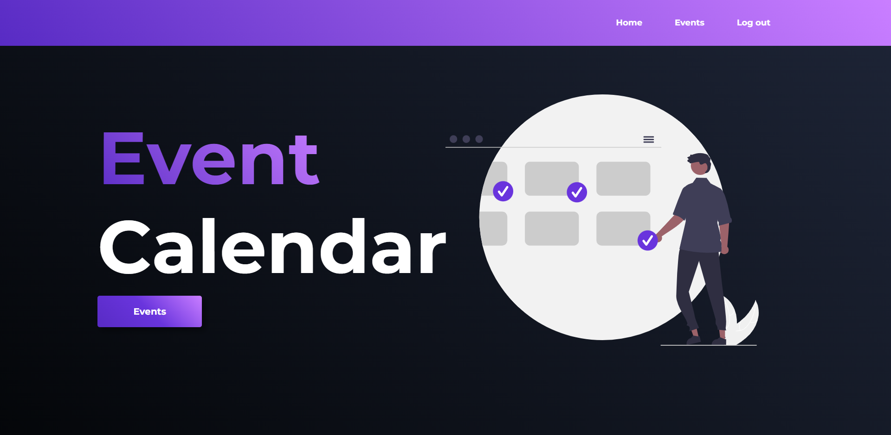
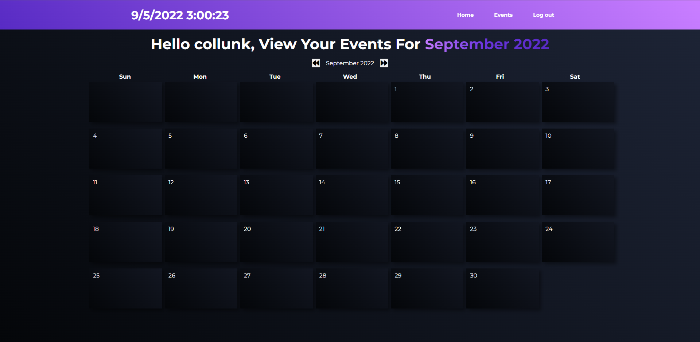

# eventCalendar
- Web app to create and save future events on user specific calendars
- Made with Django framework

## How To Run
~~~
git clone https://github.com/CollinK23/eventCalendar
~~~
~~~
cd eventCalendar
~~~
~~~
py -m virtualenv env
~~~
~~~
.\env\Scripts\activate
~~~
~~~
pip install -r requirements.txt
~~~
~~~
python manage.py makemigrations
~~~
~~~
python manage.py migrate
~~~
~~~
python manage.py createsuperuser
~~~
~~~
python manage.py runserver
~~~
